# LeRemix 

<div align="center">
  
</div>

<div align="center">

**🚀 Affordable Mobile Manipulator - Bringing Robotics to Everyone! 🎯**

[](https://opensource.org/licenses/MIT)
[](https://docs.ros.org/en/humble/)
[](http://gazebosim.org/)
[](https://github.com/cristidragomir97/leremix)

</div>

---

**LeRemix** is a fully 3D-printed mobile manipulator designed to be **affordable**, **easy to build**, and **simulation-ready**. Built on the shoulders of giants like [LeRobot](https://github.com/huggingface/lerobot) and [LeKiwi](https://github.com/SIGRobotics-UIUC), it delivers ROS2 integration and extensibility - making it the perfect foundation for **AI/VLM experimentation**, **research**, **prototyping**, and **education**.

- **3D Printable and modular**: Based on the [ORP Grid](), All structural components are 3D printable, with [STL](), [STEP]() and [Fusion 360 Project]() available. Feel free to modify, remix and add yours. 
- **URDF Model**: Kinematics, dynamics, and collision models enable proper motion planning and realistic simulation
- **Simulation**: Gazebo integration allows you to develop and test before touching hardware. 
- **Full ROS2 Integration**: Complete ros2_control implementation with standard interfaces that work seamlessly with MoveIt2, Navigation2, and the entire ROS2 ecosystem. 
- **Open Source**: Full access to all code, models, and documentation for learning and modification


# 🛠️ Hardware

LeRemix builds upon [LeKiwi](https://github.com/SIGRobotics-UIUC) with several key improvements:
- Still based on the ORP grid (20mmx20mm with 3.5mm holes)
- Larger surface area for more components
- A camera tower that allows for better perception of the surrounding environment 
- A beefy 145W power pack that gives about 4-5h of runtime, and charges over USB-C

### Parts

### Bill of Materials (BOM)

#### 🤖 Main Platform
| Part | Amount | Unit Cost (US) | Buy (US) | Unit Cost (EU) | Buy (EU) | Total(US) | Total(EU) |
|:---|:---:|:---:|:---|:---:|---:|:-:|-|
| 12v ST3215 Feetech Servo | 10| $13.89 | [Alibaba](https://www.alibaba.com/product-detail/Feetech-STS3215-SO-ARM100-Servo-12V_1601292634404.html?spm=a2700.details.you_may_like.3.5ab1478e45kY42) | €13.38 | [Alibaba](https://www.alibaba.com/product-detail/Feetech-STS3215-SO-ARM100-Servo-12V_1601292634404.html?spm=a2700.details.you_may_like.3.5ab1478e45kY42)  | 138.9$  | €133.8 | 
| 4" Omni wheels | 3 | $9.99 | [VEX Robotics](https://www.vexrobotics.com/omni-wheels.html?srsltid=AfmBOorWdWT-FIiWSAbicYWSxqYr-d5X3CJSGxMkO33WO0thwlTn4DQu) | €24.5 | [RobotShop](https://eu.robotshop.com/products/100mm-omnidirectional-wheel-brass-bearing-rollers) | $29.97 | €73.50 | 
| WaveShare ESP32 Servo Controller | 1 | $23.99 | [Amazon](https://www.amazon.com/Expansion-Bluetooth-Control-Application-Structures/dp/B09TJ3L72Q)| €17.60  |  [Kamami](https://kamami.pl/en/Servo-Controllers/1178586-servo-driver-with-esp32-servo-driver-with-wifi-and-bluetooth-esp32-module-5906623426379.html)| $23.99 | €17.60
| Adafruit USB-PD Trigger | 2 | $5.95 | [Adafruit](https://www.adafruit.com/product/5807?srsltid=AfmBOorGANfsSrXFtplHfJPSbXODZ6rRvPt-WMq5SHoeJAwd-LjJrS7J)| €6.90| [Kamami](https://kamami.pl/en/wyzwalacze-usb-pd-elektonika/1188206-usb-type-c-power-delivery-dummy-breakout-module-with-usb-type-c-power-delivery-husb238-power-supply-controller-5906623469918.html) | $11.90 | €13.80
| Adafruit ICM20948 IMU| 1 | $14.95 | [Adafruit](https://www.adafruit.com/product/4554)| €18.91 | [Kamami](https://kamami.pl/en/sensors-6dof-9dof-10dof/587247-stemma-qt-tdk-invensense-icm-20948-9-dof-imu-module-with-9-dof-sensor-icm-20948-adafruit-4554-5906623430239.html) | $14.95 | €18.91
| Baseus GP12 Battery Pack | 1 | $59.99 | [Amazon](https://www.amazon.com/Baseus-20800mAh-Portable-Charger-Charging/dp/B0DQTYLGYK?th) | €48.99 | [Baseus EU](https://eu.baseus.com/products/energeek-gp12-power-bank-145w-20800mah?srsltid=AfmBOorIXbW42jd_DKrEXTmsDzPih-Fyf3ZeOLM2nc7CQ4IjJVjFf2mJ) | $59.99 | €48.99
| **Total** |  | |  |  |  | $279.70 | €306.60

#### 📷 RGBD Cameras

**The core of this robot's perception system** is an RGB-D camera due to its incredible flexibility. Unlike a standard RGB camera, it delivers both **color and depth**, making it a versatile tool for **AI inference**, **manipulation** and **navigation**.

> 🎯 **Why RGB-D?** The robot can identify objects while estimating their distance and size, providing richer scene understanding from a single sensor. The depth stream enables multiple SLAM approaches—RGB-SLAM, RGB-D SLAM, or even 2D SLAM via `depthimage_to_laserscan`.

All software is built on the **Intel RealSense SDK** and ROS driver, but other depth cameras serve as near drop-in replacements.


| Part                | Unit Cost (US) | Buy (US) | Unit Cost (EU) | Buy (EU) | Robot + Camera (US) | Robot + Camera (EU) |
|---------------------|---------------:|:---------|---------------:|:---------|-----------------------------:|-----------------------------:|
| **YDLidar HP60C**   |  $202.00        | [RobotShop US](https://www.robotshop.com/products/ydlidar-hp60c-compact-lidar-sensor-02-4m-range-73-8-scan-angle) | €190.00 | [RobotShop EU](https://eu.robotshop.com/products/ydlidar-hp60c-compact-lidar-sensor-02-4m-range-73-8-scan-angle) | **$481.70** | **€496.60** |
| **Orbbec Gemini 2** | $234.00        | [Orbbec Store](https://store.orbbec.com/products/gemini-2) | €230.00 | [Orbbec EU](https://store.orbbec3d.com) | **$513.70** | **€536.60** |
| **Realsense D415**  |  $272.00        | [Realsense Store](https://store.realsenseai.com/buy-intel-realsense-depth-camera-d415.html) | €310.00 | [Mouser EU](https://eu.mouser.com/ProductDetail/Intel/82635AWGDVKPRQ) | **$551.70** | **€616.60**v |
| **Realsense D435**  |  $314.00        | [Realsense Store](https://store.realsenseai.com/buy-intel-realsense-depth-camera-d435.html) | €317.60 | [Mouser EU](https://eu.mouser.com/ProductDetail/Intel/82635AWGDVKPRQ) |**$593.70** | **€624.20** |
| **Stereolabs ZED 2i** |  $499.00        | [Stereolabs Store](https://store.stereolabs.com/products/zed-2i) | **€449.00** | [Stereolabs EU](https://store.stereolabs.com/products/zed-2i) | **$778.70** | **€755.60** |


#### 💻 Single Board Computers & Mini-PCs

**My setup:** Powered by an **Nvidia Orin Nano Super**, but the battery pack delivers up to **65W per power lane** and **20V**, so you can use:

- 🥧 **Raspberry Pi 5**
- 🚀 **Nvidia Orin Series**  
- 💪 **Intel NUC or other Mini-PCs**
- 🔧 **Any compatible SBC with proper power requirements**


### Core Components

| Component | Purpose | Interface |
|-----------|---------|-----------|
| 10x ST3215 Feetech Servos | Joint actuation (base + arm + head) | Serial communication |
| 3x 4" Omni wheels | Omnidirectional base movement | Motor control |
| ESP32 Servo Controller | Motor driver and communication | USB/UART |
| ICM20948 IMU | Orientation and motion sensing | I2C |
| RealSense D435 Camera | RGB-D perception | USB 3.0 |
| 20.8Ah Power Bank | System power (145W, 4-5h runtime) | USB-C PD |

---

## 🚀 Quick Start

### 🎮 Simulation (Fastest Way to Try LeRemix!)

Get the robot running in Gazebo simulation in just a few commands:

```bash
# Clone and build the workspace
git clone github.com/cristidragomir97/leremix leremix_ws
cd leremix_ws/ros
colcon build
source install/setup.bash

# Launch Gazebo simulation with controllers
ros2 launch leremix_gazebo sim.launch.py
```

The robot will spawn in Gazebo with all controllers active. 

In a new terminal - start Xbox controller teleoperation

```bash
ros2 launch leremix_teleop_xbox teleop_xbox.launch.py
```
**🎮 Xbox Controller Mapping:**
- **🏎️ Base Movement:** Right stick (forward/back + rotate left/right)
- **🦾 Arm Control:**
  - **Joint 1 & 2:** Left stick (X/Y axes)
  - **Joint 3:** Y button (+) / A button (-)
  - **Joint 4:** B button (+) / X button (-)
  - **Joint 5:** RB button (+) / LB button (-)
  - **Joint 6:** RT trigger (+) / LT trigger (-)
- **📷 Camera Control:**
  - **Pan:** D-pad left/right
  - **Tilt:** START button (+) / BACK button (-)

## 📚 Documentation

For detailed setup instructions, hardware configuration, and troubleshooting, see:

**📖 [Getting Started Guide](docs/getting-started.md)** - Complete installation and setup instructions for both simulation and hardware

---

## 🏗️ Architecture

### 🔄 System Overview

LeRemix follows a modular ROS2 architecture that separates concerns between simulation, hardware interfaces, control, and user interaction. The system uses standard ROS2 patterns like `ros2_control` for hardware abstraction and topic-based communication for sensor data.

#### **General Block Schematic**

```mermaid
graph TB


    subgraph "Sensors"

        WristCamera[UVC 32x32 RGB Camera]
        HeadCamera[RealSense RGB-D Camera]
        IMU[IMU Sensor]
    end
    

    API[📡 ROS2 APIs<br/>MoveIt2, Nav2, etc.]
    Apps[🤖 AI/ML Applications]
    

    subgraph "Control Layer"
        Xbox[🎮 Xbox Controller]
        Control[🎛️ ros2_control Framework]
        Bridge[🌉 Hardware Bridge<br/>control_plugin + servo_manager]
    end
    
    subgraph "Actuators"
        Base[🛞 Omnidirectional Base]
        Arm[🦾 6-DOF SO101 Arm ]
        Head[🗼 Pan & Tilt System]
    end


    Apps --> API
    API --> Control 
    API <--> Apps
    Xbox --> Control
    Control --> Bridge

    IMU -->|Something|API
    WristCamera --> API
    HeadCamera --> API

    Base <-->|/motor_manager/base_cmd|Bridge
    Arm <--> |/motor_manager/base_cmd|Bridge
    Head <--> |/motor_manager/base_cmd|Bridge


    
    style Apps fill:#f3e5f5
    style Control fill:#e8f5e8
    style Bridge fill:#e8f5e8
    style Base fill:#ffecb3
    style Arm fill:#ffecb3
    style Head fill:#ffecb3
```



#### **Package Perspective**

```mermaid
graph LR
    Xbox[🎮 Xbox Controller<br/>leremix_teleop_xbox]
    Control[⚙️ Control System<br/>leremix_control]
    Plugin[🔌 Control Plugin<br/>leremix_control_plugin] 
    ServoMgr[🔧 Servo Manager<br/>leremix_servo_manager]
    Camera[📷 Camera System<br/>leremix_camera]
    IMU[📐 IMU System<br/>leremix_imu]
    Description[📐 Robot Model<br/>leremix_description]
    
    Xbox --> Control
    Control --> Plugin
    Plugin --> ServoMgr
    ServoMgr --> Hardware[🤖 Physical Robot]
    Camera --> Hardware
    IMU --> Hardware
    Description --> Control
```



### 📦 Package Overview

| Package | Purpose | Language | Key Topics | Launch Command |
|---------|---------|----------|------------|----------------|
| **leremix_description** | Robot URDF model & transforms | XML/Python | `/robot_description`, `/tf`, `/joint_states` | `ros2 launch leremix_description view_robot.launch.py` |
| **leremix_servo_manager** | Direct motor control (C++) | C++ | `/motor_manager/*_cmd`, `/motor_manager/joint_states` | `ros2 launch leremix_servo_manager servo_manager.launch.py` |
| **leremix_servo_manager_py** | Motor control with advanced braking | Python | `/motor_manager/*_cmd`, `/motor_manager/joint_states` | `ros2 launch leremix_servo_manager_py servo_manager.launch.py` |
| **leremix_control_plugin** | ros2_control hardware bridge | C++ | `/cmd_vel`, `/arm_controller/joint_trajectory` | `ros2 launch leremix_control_plugin bringup.launch.py` |
| **leremix_teleop_xbox** | Xbox controller interface | Python | `/cmd_vel`, `/joy` | `ros2 launch leremix_teleop_xbox teleop_xbox.launch.py` |
| **leremix_control** | Controller configurations | YAML | N/A (config files) | Loaded by control_plugin |
| **leremix_camera** | RGB-D camera & vision | Python | `/head_camera/*`, `/scan`, `/wrist_camera/*` | `ros2 launch leremix_camera camera.launch.py` |
| **leremix_imu** | IMU sensor & fusion | Python | `/imu/data`, `/imu/fused` | `ros2 launch leremix_imu imu.launch.py` |

### 📦 Detailed Package Information

#### **📐 leremix_description - Robot Model**

**What it does:** Provides the complete URDF/Xacro robot model with accurate physical properties, joint limits, collision meshes, and visual representations. This is the "digital twin" of your physical robot.

**Nodes launched:**
- `robot_state_publisher` - Publishes robot transforms and joint states
- `joint_state_publisher` - (Optional) For manual joint control in simulation

**How to run:**
```bash
# Standalone URDF visualization
ros2 launch leremix_description view_robot.launch.py

# Load robot model for other packages
ros2 run robot_state_publisher robot_state_publisher --ros-args -p robot_description:="$(xacro $(ros2 pkg prefix leremix_description)/share/leremix_description/urdf/leremix.urdf.xacro)"
```

**Key topics:**
- `/robot_description` - URDF robot model
- `/tf` and `/tf_static` - Robot transforms
- `/joint_states` - Current joint positions


#### **🔧 leremix_servo_manager - Direct Motor Control (C++)**

**What it does:** Handles low-level communication with FEETECH STS servos via serial protocol. Converts ROS2 joint commands into servo-specific position/velocity commands and provides real-time telemetry feedback.

**Nodes launched:**
- `servo_manager_node` - Main servo communication node
- `ping_test` - (Optional) Motor connectivity testing utility

**How to run:**
```bash
# Main servo manager (requires hardware)
ros2 launch leremix_servo_manager servo_manager.launch.py

# Test motor connectivity
ros2 launch leremix_servo_manager ping_test.launch.py

# Custom serial port
ros2 launch leremix_servo_manager servo_manager.launch.py port:=/dev/ttyTHS1 baud:=1000000
```

**Key topics:**
- `/motor_manager/base_cmd` - Base motor velocity commands
- `/motor_manager/arm_cmd` - Arm motor position commands  
- `/motor_manager/head_cmd` - Head motor position commands
- `/motor_manager/joint_states` - Motor telemetry feedback

**Configuration:** Edit `config/servo_manager.yaml` to adjust motor IDs, serial settings, and control parameters.

---

#### **🐍 leremix_servo_manager_py - Python Motor Control**

**What it does:** Python-based alternative to the C++ servo manager with modular architecture, advanced braking system, and improved error handling. Provides the same functionality with enhanced safety features and easier customization.

**Features:**
- **Advanced Braking System**: Three configurable braking methods to prevent power spikes
- **Modular Architecture**: Clean separation of motor management, configuration, and command handling
- **Improved Safety**: Comprehensive connectivity testing and graceful error recovery
- **Enhanced Telemetry**: Detailed motor state monitoring and diagnostics

**Nodes launched:**
- `servo_manager_node.py` - Main Python servo manager node

**How to run:**
```bash
# Main Python servo manager (requires hardware)
ros2 launch leremix_servo_manager_py servo_manager.launch.py

# Test brake methods
ros2 launch leremix_servo_manager_py test_brake_methods.launch.py

# Custom configuration
ros2 launch leremix_servo_manager_py servo_manager.launch.py config_file:=custom_config.yaml
```

**Key topics:** (Same as C++ version)
- `/motor_manager/base_cmd` - Base motor velocity commands
- `/motor_manager/arm_cmd` - Arm motor position commands  
- `/motor_manager/head_cmd` - Head motor position commands
- `/motor_manager/joint_states` - Motor telemetry feedback

**Configuration:** Edit `config/servo_manager.yaml` to adjust motor IDs, serial settings, braking method, and control parameters.

> **💡 When to use:** Choose the Python version for enhanced safety features, easier customization, or when you need advanced braking control. Both versions are fully compatible with the rest of the system.

---

#### **🔌 leremix_control_plugin - Hardware Bridge**

**What it does:** Acts as the ros2_control hardware interface, bridging standard ROS2 controllers with the servo manager. Enables seamless integration with MoveIt2, navigation, and other ROS2 tools.

**Nodes launched:**
- `controller_manager` - ros2_control manager
- `omnidirectional_controller` - Base movement controller
- `arm_controller` - Arm trajectory controller
- `joint_state_broadcaster` - Joint state publisher

**How to run:**
```bash
# Launch with hardware interface
ros2 launch leremix_control_plugin bringup.launch.py

# Simulation mode (requires Gazebo)
ros2 launch leremix_control_plugin bringup.launch.py use_sim_time:=true
```

**Key topics:**
- `/cmd_vel` - Base velocity commands (input)
- `/arm_controller/joint_trajectory` - Arm trajectory commands (input)
- `/joint_states` - Combined joint states (output)
- `/controller_manager/*` - Controller status and management

---

#### **🎮 leremix_teleop_xbox - Manual Control**

**What it does:** Provides intuitive Xbox controller mapping for manual robot operation. Maps controller inputs to robot movements with safety limits and smooth control.

**Nodes launched:**
- `teleop_xbox_node` - Xbox controller interface
- `joy_node` - Joystick driver

**How to run:**
```bash
# Standard Xbox controller
ros2 launch leremix_teleop_xbox teleop_xbox.launch.py

# Custom controller device
ros2 launch leremix_teleop_xbox teleop_xbox.launch.py device:=/dev/input/js1
```

**Controller mapping:**
- **Right stick:** Base movement (forward/back + strafe left/right)
- **Left stick:** Arm joints 1 & 2
- **Buttons:** Arm joints 3-6 (Y/A, B/X, RB/LB, RT/LT)
- **D-pad:** Camera pan/tilt (left/right, START/BACK)

**Key topics:**
- `/cmd_vel` - Base velocity output
- `/arm_controller/joint_trajectory` - Arm movement output
- `/joy` - Raw joystick data

---

#### **⚙️ leremix_control - Controller Configuration**

**What it does:** Provides controller configurations and parameter files for the omnidirectional base and 6-DOF arm using standard ros2_control patterns.

**Configuration files:**
- `config/controllers.yaml` - Controller parameters
- `config/ros2_control.yaml` - Hardware interface config
- `config/joint_limits.yaml` - Safety limits

**Loaded by:** leremix_control_plugin (no standalone launch)

**Key parameters:**
- Velocity limits for base wheels
- Position/velocity limits for arm joints
- Controller gains and dynamics


#### **📷 leremix_camera - Vision System**

**What it does:** Integrates RGB-D cameras with compressed image transport and depth-to-laser conversion. Provides both manipulation-ready RGB-D data and navigation-ready 2D laser scans.

**Nodes launched:**
- `realsense2_camera_node` - RealSense D435 driver
- `depthimage_to_laserscan` - Depth to 2D scan converter
- `image_transport` - Compressed image streaming
- `usb_cam_node` - (Optional) Wrist camera driver

**How to run:**
```bash
# Full camera system
ros2 launch leremix_camera camera.launch.py

# RealSense only
ros2 launch leremix_camera realsense.launch.py

# With custom resolution
ros2 launch leremix_camera camera.launch.py width:=1280 height:=720
```

**Key topics:**
- `/head_camera/color/image_raw` - RGB images
- `/head_camera/depth/image_rect_raw` - Depth images
- `/head_camera/rgbd` - Combined RGB-D data
- `/scan` - 2D laser scan from depth
- `/wrist_camera/image_raw` - Wrist camera feed

---

#### **📐 leremix_imu - Orientation Sensing**

**What it does:** Handles ICM20948 9-DOF sensor integration with Madgwick sensor fusion, providing calibrated orientation data crucial for navigation and balance.

**Nodes launched:**
- `imu_filter_madgwick` - Sensor fusion node
- `icm20948_driver` - Raw IMU data driver

**How to run:**
```bash
# IMU with sensor fusion
ros2 launch leremix_imu imu.launch.py

# Raw IMU data only
ros2 run leremix_imu icm20948_driver
```

**Key topics:**
- `/imu/data` - Raw IMU measurements
- `/imu/fused` - Fused orientation estimate
- `/imu/mag` - Magnetometer data

**Calibration:** Run calibration sequence on first setup:
```bash
ros2 run leremix_imu calibrate_imu
```


### 🔗 Communication Flow

#### **Command Path (User → Hardware)**
1. **User Input** (Xbox/MoveIt) → `cmd_vel` & `joint_trajectory` topics
2. **ros2_control** → Processes commands through controllers  
3. **Control Plugin** → Publishes motor commands to `/motor_manager/*_cmd` topics
4. **Servo Manager** → Converts to servo protocol and sends via serial
5. **FEETECH Servos** → Execute motion commands

#### **Feedback Path (Hardware → User)**
1. **FEETECH Servos** → Report position/velocity via serial
2. **Servo Manager** → Converts to ROS joint states → `/motor_manager/joint_states`
3. **Control Plugin** → Feeds back to ros2_control framework
4. **Controllers** → Update control loops and publish status
5. **User Interface** → Displays robot state and feedback

### ⚙️ Key Technologies

- **🎛️ ros2_control**: Hardware abstraction and controller framework
- **📡 Topic Communication**: Decoupled motor command/feedback via ROS topics  
- **🔄 Real-time Control**: High-frequency servo communication (50Hz+ telemetry)
- **🎮 Standard Interfaces**: Compatible with MoveIt2, Navigation2, and other ROS2 tools
- **🔧 Modular Design**: Easy to swap components, add sensors, or modify controllers

---

## 🛠️ Hardware

### 🧱 Bill of Materials (BOM)

#### 🤖 Main Platform
| Part | Amount | Unit Cost (US) | Buy (US) | Unit Cost (EU) | Buy (EU) | Total(US) | Total(EU) |
|:---|:---:|:---:|:---|:---:|---:|:-:|-|
| 12v ST3215 Feetech Servo | 10| $13.89 | [Alibaba](https://www.alibaba.com/product-detail/Feetech-STS3215-SO-ARM100-Servo-12V_1601292634404.html?spm=a2700.details.you_may_like.3.5ab1478e45kY42) | €13.38 | [Alibaba](https://www.alibaba.com/product-detail/Feetech-STS3215-SO-ARM100-Servo-12V_1601292634404.html?spm=a2700.details.you_may_like.3.5ab1478e45kY42)  | 138.9$  | €133.8 | 
| 4" Omni wheels | 3 | $9.99 | [VEX Robotics](https://www.vexrobotics.com/omni-wheels.html?srsltid=AfmBOorWdWT-FIiWSAbicYWSxqYr-d5X3CJSGxMkO33WO0thwlTn4DQu) | €24.5 | [RobotShop](https://eu.robotshop.com/products/100mm-omnidirectional-wheel-brass-bearing-rollers) | $29.97 | €73.50 | 
| WaveShare ESP32 Servo Controller | 1 | $23.99 | [Amazon](https://www.amazon.com/Expansion-Bluetooth-Control-Application-Structures/dp/B09TJ3L72Q)| €17.60  |  [Kamami](https://kamami.pl/en/Servo-Controllers/1178586-servo-driver-with-esp32-servo-driver-with-wifi-and-bluetooth-esp32-module-5906623426379.html)| $23.99 | €17.60
| Adafruit USB-PD Trigger | 2 | $5.95 | [Adafruit](https://www.adafruit.com/product/5807?srsltid=AfmBOorGANfsSrXFtplHfJPSbXODZ6rRvPt-WMq5SHoeJAwd-LjJrS7J)| €6.90| [Kamami](https://kamami.pl/en/wyzwalacze-usb-pd-elektonika/1188206-usb-type-c-power-delivery-dummy-breakout-module-with-usb-type-c-power-delivery-husb238-power-supply-controller-5906623469918.html) | $11.90 | €13.80
| Adafruit ICM20948 IMU| 1 | $14.95 | [Adafruit](https://www.adafruit.com/product/4554)| €18.91 | [Kamami](https://kamami.pl/en/sensors-6dof-9dof-10dof/587247-stemma-qt-tdk-invensense-icm-20948-9-dof-imu-module-with-9-dof-sensor-icm-20948-adafruit-4554-5906623430239.html) | $14.95 | €18.91
| Baseus GP12 Battery Pack | 1 | $59.99 | [Amazon](https://www.amazon.com/Baseus-20800mAh-Portable-Charger-Charging/dp/B0DQTYLGYK?th) | €48.99 | [Baseus EU](https://eu.baseus.com/products/energeek-gp12-power-bank-145w-20800mah?srsltid=AfmBOorIXbW42jd_DKrEXTmsDzPih-Fyf3ZeOLM2nc7CQ4IjJVjFf2mJ) | $59.99 | €48.99
| **Total** |  | |  |  |  | $279.70 | €306.60

#### 📷 RGBD Cameras

**The core of this robot's perception system** is an RGB-D camera due to its incredible flexibility. Unlike a standard RGB camera, it delivers both **color and depth**, making it a versatile tool for **AI inference**, **manipulation** and **navigation**.

> 🎯 **Why RGB-D?** The robot can identify objects while estimating their distance and size, providing richer scene understanding from a single sensor. The depth stream enables multiple SLAM approaches—RGB-SLAM, RGB-D SLAM, or even 2D SLAM via `depthimage_to_laserscan`.

All software is built on the **Intel RealSense SDK** and ROS driver, but other depth cameras serve as near drop-in replacements.


| Part                | Unit Cost (US) | Buy (US) | Unit Cost (EU) | Buy (EU) | Robot + Camera (US) | Robot + Camera (EU) |
|---------------------|---------------:|:---------|---------------:|:---------|-----------------------------:|-----------------------------:|
| **YDLidar HP60C**   |  $202.00        | [RobotShop US](https://www.robotshop.com/products/ydlidar-hp60c-compact-lidar-sensor-02-4m-range-73-8-scan-angle) | €190.00 | [RobotShop EU](https://eu.robotshop.com/products/ydlidar-hp60c-compact-lidar-sensor-02-4m-range-73-8-scan-angle) | **$481.70** | **€496.60** |
| **Orbbec Gemini 2** | $234.00        | [Orbbec Store](https://store.orbbec.com/products/gemini-2) | €230.00 | [Orbbec EU](https://store.orbbec3d.com) | **$513.70** | **€536.60** |
| **Realsense D415**  |  $272.00        | [Realsense Store](https://store.realsenseai.com/buy-intel-realsense-depth-camera-d415.html) | €310.00 | [Mouser EU](https://eu.mouser.com/ProductDetail/Intel/82635AWGDVKPRQ) | **$551.70** | **€616.60**v |
| **Realsense D435**  |  $314.00        | [Realsense Store](https://store.realsenseai.com/buy-intel-realsense-depth-camera-d435.html) | €317.60 | [Mouser EU](https://eu.mouser.com/ProductDetail/Intel/82635AWGDVKPRQ) |**$593.70** | **€624.20** |
| **Stereolabs ZED 2i** |  $499.00        | [Stereolabs Store](https://store.stereolabs.com/products/zed-2i) | **€449.00** | [Stereolabs EU](https://store.stereolabs.com/products/zed-2i) | **$778.70** | **€755.60** |


#### 💻 Single Board Computers & Mini-PCs

**My setup:** Powered by an **Nvidia Orin Nano Super**, but the battery pack delivers up to **65W per power lane** and **20V**, so you can use:

- 🥧 **Raspberry Pi 5**
- 🚀 **Nvidia Orin Series**  
- 💪 **Intel NUC or other Mini-PCs**
- 🔧 **Any compatible SBC with proper power requirements**


---

## 🙏 Credits & Acknowledgments
This project stands on the shoulders of incredible open-source work:

- **[LeRobot Team](https://github.com/huggingface/lerobot)** - For pioneering accessible robotics and AI integration
- **[SIGRobotics-UIUC](https://github.com/SIGRobotics-UIUC)** - For their foundational work on LeKiwi
- **[Pavan Vishwanath](https://github.com/Pavankv92)** - ROS2 package development for [LeRobot SO-ARM101](https://github.com/Pavankv92/lerobot_ws)
- **[Mateus Menezes](https://github.com/mateusmenezes95)** - [Omnidirectional controllers](https://github.com/mateusmenezes95/omnidirectional_controllers) and [AxeBot](https://github.com/mateusmenezes95/axebot) simulation expertise
- **[Gaotian Wang](https://github.com/Vector-Wangel/XLeRobot)** - For his amazing work on XLeRobot. Also for being kind enough to publish the STEP files for his robot upon request, files that were used to create the camera tower for LeRemix. 


<div align="center">

**⭐ Star this repo if LeRemix helped you build something awesome! ⭐**

*Built with ❤️ for the robotics community*

</div>
