# LeRemix

<div style="display: flex; align-items: center; gap: 20px; margin: 20px 0;">
  <div style="flex: 1;">
    <p><strong>🚀 Affordable Mobile Manipulator - Bringing Robotics to Everyone! 🎯</strong></p>

    <p><strong>LeRemix</strong> is a fully 3D-printed mobile manipulator built for <strong>AI experimentation</strong>, <strong>research</strong>, and <strong>education</strong>. Standing on the shoulders of <a href="https://github.com/huggingface/lerobot">LeRobot</a> and <a href="https://github.com/SIGRobotics-UIUC">LeKiwi</a>, it combines affordability with professional-grade ROS2 integration.</p>

    <div align="center">
      <a href="https://opensource.org/licenses/MIT"></a>
      <a href="https://docs.ros.org/en/humble/"></a>
      <a href="http://gazebosim.org/"></a>
      <a href="https://github.com/cristidragomir97/leremix"></a>
    </div>
  </div>

  <div style="flex: 1;">
    
  </div>
</div>

---

* 🔧 **Fully 3D Printable** - [ORP Grid-based design]() with complete CAD files
* 🎮 **Simulation Ready** - Full Gazebo integration for safe development
* 🤖 **ROS2 Native** - Complete ros2_control with MoveIt2 & Nav2 compatibility
* 📷 **RGB-D Vision** - Built-in depth perception for advanced AI workflows
* ⚡ **145W Power** - 4-5 hours runtime with USB-C charging
* 💰 **Affordable** - Starting at ~$280 for the base platform


| Configuration | US Price | EU Price | What's Included |
|---------------|----------|----------|-----------------|
| **Base Platform** | **$280** | **€307** | Servos, wheels, controller, IMU, battery |
| **+ RGB-D Camera** | **$514-779** | **€537-756** | + Orbbec Gemini 2/ZED 2i |
| **+ LIDAR** | **$603-868** | **€626-845** | + RPLidar C1/YDLidar options |

**📋 [Complete BOM & Sourcing Guide](docs/bom.md)**

---

## 🚀 Quick Start

### 🎮 Simulation (Fastest Way to Try LeRemix!)

Get the robot running in Gazebo simulation in just a few commands:

```bash
# Clone and build the workspace
git clone github.com/cristidragomir97/leremix leremix_ws
cd leremix_ws/ros
colcon build
source install/setup.bash

# Launch Gazebo simulation with controllers
ros2 launch leremix_gazebo sim.launch.py
```

The robot will spawn in Gazebo with all controllers active. 

In a new terminal - start Xbox controller teleoperation

```bash
ros2 launch leremix_teleop_xbox teleop_xbox.launch.py
```
**🎮 Xbox Controller Mapping:**
- **🏎️ Base Movement:** Right stick (forward/back + rotate left/right)
- **🦾 Arm Control:**
  - **Joint 1 & 2:** Left stick (X/Y axes)
  - **Joint 3:** Y button (+) / A button (-)
  - **Joint 4:** B button (+) / X button (-)
  - **Joint 5:** RB button (+) / LB button (-)
  - **Joint 6:** RT trigger (+) / LT trigger (-)
- **📷 Camera Control:**
  - **Pan:** D-pad left/right
  - **Tilt:** START button (+) / BACK button (-)

## 📚 Documentation

For detailed setup instructions, hardware configuration, and troubleshooting, see:

**📖 [Getting Started Guide](docs/getting-started.md)** - Complete installation and setup instructions for both simulation and hardware

---

## 🏗️ Architecture

LeRemix follows a modular ROS2 architecture that separates concerns between simulation, hardware interfaces, control, and user interaction. The system uses standard ROS2 patterns like `ros2_control` for hardware abstraction and topic-based communication for sensor data.

```mermaid
graph TB

    LeRemixDescription[📦 LeRemix_Description]
    API[📡 ROS2]
    Apps[🤖 AI/ML Applications]

    subgraph "Sensors"
        WristCamera[📷 Wrist Camera<br/>UVC 32x32 RGB]
        HeadCamera[📷 Head Camera<br/>RealSense RGB-D]
        IMU[📐 IMU Sensor<br/>ICM20948]
        LIDAR[📏 LIDAR ]
         CameraNode[📦 LeRemix_Camera]
        ImuNode[📦 LeRemix_IMU]
        LidarNode[📦 rplidar]
    end

    subgraph "Control Layer"
        Control[🎛️ ros2_control Framework]
        LeRemixControl[📦 LeRemix_Control]
        LeRemixControlPlugin[📦 LeRemix_ControlPlugin]
    end
    
    subgraph "Actuators"
        LeRemixServoManager[📦 LeRemix_ServoManager]
        Base[<strong>Omnidirectional Base</strong><br/>3x ST3215 Servos]
        Arm[6-DOF Arm<br/>7x ST3215 Servos]
        Head[Pan & Tilt System<br/>2x ST3215 Servos]
    end


    %% Top to bottom flow
    LeRemixDescription --> API

    LIDAR --> LidarNode
    WristCamera --> CameraNode
    HeadCamera --> CameraNode
    IMU --> ImuNode

    LidarNode --> API
    CameraNode --> API
    ImuNode --> API

    API <--> Apps
    API --> Control

    LeRemixControl --> Control
    Control --> LeRemixControlPlugin
    LeRemixControlPlugin --> LeRemixServoManager

    LeRemixServoManager --> Base
    LeRemixServoManager --> Arm
    LeRemixServoManager --> Head
    
    style CameraNode fill:#ffecb3
    style LidarNode fill:#ffecb3
    style ImuNode fill:#ffecb3

    style LeRemixControl fill:#ffecb3
    style LeRemixControlPlugin fill:#ffecb3
    style LeRemixServoManager fill:#ffecb3

    style Apps fill:#f3e5f5
    style API fill:#e8f4fd
    style Control fill:#e8f5e8

    style Base fill:#f3e5f5
    style Arm fill:#f3e5f5
    style Head fill:#f3e5f5
```



--- 

### 📦 ROS Packages

**Core Packages:**
- [**leremix_description**](ros/src/leremix_description/) - Robot URDF model with accurate kinematics and collision meshes
- [**leremix_control_plugin**](ros/src/leremix_control_plugin) - ros2_control hardware bridge enabling MoveIt2/Nav2 integration
- [**leremix_control**]() - Controller parameters and ros2_control configurations
- [**leremix_servo_manager**]() - Low-level motor control with real-time telemetry
- [**leremix_teleop_xbox**]() - Xbox controller interface for manual operation

**Sensor & Vision:**
- [**leremix_camera**]() - RGB-D camera integration with depth-to-laser conversion
- [**leremix_imu**]() - IMU sensor fusion for orientation and navigation

**Simulation Packages**
- **leremix_gazebo** - Configurations and launch files for the Gazebo Classic


**📋 [Detailed Package Documentation](docs/packages.md)**


--- 
## 🙏 Credits & Acknowledgments
This project stands on the shoulders of incredible open-source work:

- **[LeRobot Team](https://github.com/huggingface/lerobot)** - For pioneering accessible robotics and AI integration
- **[SIGRobotics-UIUC](https://github.com/SIGRobotics-UIUC)** - For their foundational work on LeKiwi
- **[Pavan Vishwanath](https://github.com/Pavankv92)** - ROS2 package development for [LeRobot SO-ARM101](https://github.com/Pavankv92/lerobot_ws)
- **[Mateus Menezes](https://github.com/mateusmenezes95)** - [Omnidirectional controllers](https://github.com/mateusmenezes95/omnidirectional_controllers) and [AxeBot](https://github.com/mateusmenezes95/axebot) simulation expertise
- **[Gaotian Wang](https://github.com/Vector-Wangel/XLeRobot)** - For his amazing work on XLeRobot. Also for being kind enough to publish the STEP files for his robot upon request, files that were used to create the camera tower for LeRemix. 

---
<div align="center">

<strong>⭐ Star this repo if LeRemix helped you build something awesome! ⭐</strong>
</div>