# LeRemix
<p>
  <a href="https://opensource.org/licenses/MIT"></a>
  <a href="https://docs.ros.org/en/humble/"></a>
  <a href="http://gazebosim.org/"></a>
</p>

<p align="center">
  
</p>


**LeRemix** is a fully 3D-printed mobile manipulator designed for **AI experimentation**, **research**, and **education**. Building upon [LeRobot](https://github.com/huggingface/lerobot) and [LeKiwi](https://github.com/SIGRobotics-UIUC), it introduces hardware improvements and comprehensive ROS2 integration.

* 🔧 **Fully 3D Printable** - ORP Grid-based modular design with complete CAD files
* 🤖 **ROS2 Native** - Complete ros2_control integration with MoveIt2 & Nav2 support
* 🎮 **Simulation Ready** - Digital-twin Gazebo simulation with virtual sensors and controllers
* 📷 **RGB-D Vision** - Integrated depth perception for advanced AI workflows
* ⚡ **145W Power** - 4-5 hours runtime with USB-C charging
* 💰 **Affordable** - Starting at ~$280 for the base platform

---

## ⚙️ Hardware 
The LeRemix platform combines a **3-wheel omnidirectional base** for holonomic motion with a **6-DOF SO-ARM100 robotic arm** for manipulation tasks. A **pan-tilt elevated camera mount** provides flexible perception capabilities, allowing the robot to survey its environment while performing manipulation operations.

LeRemix is designed to be easy to assamble, easy to get started with and easy to expand. 

### Actuators

**11x Feetech STS3215 Servos (12V, 30KG torque):**
- 3x Base wheels (omnidirectional drive)
- 6x Arm joints (SO-ARM100)
- 2x Camera head (pan & tilt)

**Control Options:**
- [FE-URT-1](https://www.feetechrc.com/FE-URT1-C001.html)
- [Waveshare Serial Bus Servo Driver](https://www.waveshare.com/bus-servo-adapter-a.htm)

### Power System

- **145W USB-C power bank** with USB-PD trigger modules
- **Hot-swappable charging** - operate while charging
- **4-5 hour runtime** on single charge
- **Nearly solderless** - simplified assembly

### Sensors & Perception

- **RGB-D Camera** - RealSense D435i, ZED 2i, or Orbbec Gemini 2
- **IMU (ICM-20948)** - 9-axis sensor for odometry and SLAM
- **LiDAR (Optional)** - RPLidar C1
- **Wrist Camera** - 640x480 USB camera for manipulation tasks
- **Universal 1/4" mount** - Compatible with various camera systems

### Mechanical Design
- **[ORP Grid-based structure](https://openroboticplatform.com/designrules)** - Modular, expandable design
- **3D printable STL files** - Available in [`/parts`](/parts/) directory
- **Fusion 360 source** - Editable CAD files for customization
- **Expansion ready** - 20x20mm Grid layout supports additional sensors and actuators

### System Diagram


### Pricing
**📋 [Complete BOM & Sourcing Guide](docs/bom.md)**
| Configuration | US Price | EU Price | What's Included |
|---------------|----------|----------|-----------------|
| **Base Platform** | **$280** | **€307** | Servos, wheels, controller, IMU, battery |
| **+ RGB-D Camera** | **$514-779** | **€537-756** | + Orbbec Gemini 2/ZED 2i |
| **+ LIDAR** | **$603-868** | **€626-845** | + RPLidar C1/YDLidar options |


---

## 🚀 Quick Start

### 🎮 Simulation (Fastest Way to Try LeRemix!)

Get the robot running in Gazebo simulation in just a few commands:

```bash
# Clone and build the workspace
git clone github.com/cristidragomir97/leremix leremix_ws
cd leremix_ws/ros
colcon build
source install/setup.bash

# Launch Gazebo simulation with controllers
ros2 launch leremix_gazebo sim.launch.py
```

The robot will spawn in Gazebo with all controllers active. 

In a new terminal - start Xbox controller teleoperation

```bash
ros2 launch leremix_teleop_xbox teleop_xbox.launch.py
```
**🎮 Xbox Controller Mapping:**
- **🏎️ Base Movement:** Right stick (forward/back + rotate left/right)
- **🦾 Arm Control:**
  - **Joints 1 & 2:** Left stick (X/Y axes)
  - **Joint 3:** Y button (+) / A button (-)
  - **Joint 4:** B button (+) / X button (-)
  - **Joint 5:** RB button (+) / LB button (-)
  - **Joint 6:** RT trigger (+) / LT trigger (-)
- **📷 Camera Control:**
  - **Pan:** D-pad left/right
  - **Tilt:** D-pad up/down

For detailed setup instructions, hardware configuration, and troubleshooting, see:

**📖 [Getting Started Guide](docs/getting-started.md)** - Complete installation and setup instructions for both simulation and hardware

---

## 🏗️ Architecture

LeRemix follows a modular ROS2 architecture that separates concerns between simulation, hardware interfaces, control, and user interaction. 

- **Hardware Abstraction**: The `ros2_control` framework provides a clean interface between high-level controllers (MoveIt2, Nav2) and low-level hardware, allowing the same code to run in both simulation and on real hardware.

- **Modular Sensors**: Each sensor system (cameras, IMU, LIDAR) is encapsulated in its own ROS2 package, publishing standardized messages that any application can consume. This makes it easy to swap sensors or add new ones without modifying application code.

- **Layered Control**: The control stack is separated into layers - from the servo manager handling individual motor commands, through the ros2_control plugin managing the hardware interface, up to high-level motion planning with MoveIt2 and navigation with Nav2.

- **Simulation-First Development**: Gazebo integration allows safe development and testing before deploying to hardware. The same launch files and controllers work in both environments, reducing the simulation-to-reality gap.

```mermaid
graph TB

    LeRemixDescription[📦 LeRemix_Description]
    API[📡 ROS2]
    Apps[🤖 AI/ML Applications]

    subgraph "Sensors"
        WristCamera[📷 Wrist Camera<br/>UVC 32x32 RGB]
        HeadCamera[📷 Head Camera<br/>RealSense RGB-D]
        IMU[📐 IMU Sensor<br/>ICM20948]
        LIDAR[📏 LIDAR ]
         CameraNode[📦 LeRemix_Camera]
        ImuNode[📦 LeRemix_IMU]
        LidarNode[📦 rplidar]
    end

    subgraph "Control Layer"
        Control[🎛️ ros2_control Framework]
        LeRemixControl[📦 LeRemix_Control]
        LeRemixControlPlugin[📦 LeRemix_ControlPlugin]
    end
    
    subgraph "Actuators"
        LeRemixServoManager[📦 LeRemix_ServoManager]
        Base[<strong>Omnidirectional Base</strong><br/>3x ST3215 Servos]
        Arm[6-DOF Arm<br/>7x ST3215 Servos]
        Head[Pan & Tilt System<br/>2x ST3215 Servos]
    end


    %% Top to bottom flow
    LeRemixDescription --> API

    LIDAR --> LidarNode
    WristCamera --> CameraNode
    HeadCamera --> CameraNode
    IMU --> ImuNode

    LidarNode --> API
    CameraNode --> API
    ImuNode --> API

    API <--> Apps
    API --> Control

    LeRemixControl --> Control
    Control --> LeRemixControlPlugin
    LeRemixControlPlugin --> LeRemixServoManager

    LeRemixServoManager --> Base
    LeRemixServoManager --> Arm
    LeRemixServoManager --> Head
    
```




--- 

### 📦 ROS Packages

**Core Packages:**
- [**leremix_description**](ros/src/leremix_description/) - Robot URDF model with accurate kinematics and collision meshes
- [**leremix_control_plugin**](ros/src/leremix_control_plugin) - ros2_control hardware bridge enabling MoveIt2/Nav2 integration
- [**leremix_control**]() - Controller parameters and ros2_control configurations
- [**leremix_servo_manager**]() - Low-level motor control with real-time telemetry
- [**leremix_teleop_xbox**]() - Xbox controller interface for manual operation

**Sensor & Vision:**
- [**leremix_camera**]() - RGB-D camera integration with depth-to-laser conversion
- [**leremix_imu**]() - IMU sensor fusion for orientation and navigation

**Simulation Packages**
- **leremix_gazebo** - Configurations and launch files for the Gazebo Classic


**📋 [Detailed Package Documentation](docs/packages.md)**


--- 
## 🙏 Credits & Acknowledgments
This project stands on the shoulders of incredible open-source work:

- **[LeRobot Team](https://github.com/huggingface/lerobot)** - For pioneering accessible robotics and AI integration
- **[SIGRobotics-UIUC](https://github.com/SIGRobotics-UIUC)** - For their foundational work on LeKiwi
- **[Pavan Vishwanath](https://github.com/Pavankv92)** - ROS2 package development for [LeRobot SO-ARM101](https://github.com/Pavankv92/lerobot_ws)
- **[Mateus Menezes](https://github.com/mateusmenezes95)** - [Omnidirectional controllers](https://github.com/mateusmenezes95/omnidirectional_controllers) and [AxeBot](https://github.com/mateusmenezes95/axebot) simulation expertise
- **[Gaotian Wang](https://github.com/Vector-Wangel/XLeRobot)** - For his amazing work on XLeRobot. Also for being kind enough to publish the STEP files for his robot upon request, files that were used to create the camera tower for LeRemix. 

---
<div align="center">

<strong>⭐ Star this repo if LeRemix helped you build something awesome! ⭐</strong>
</div>